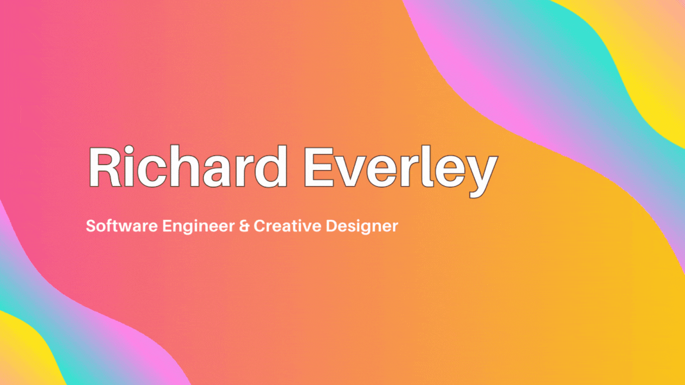

# Hi 👋 I am Richard!

University of Auckland Computer Science sophomore student. Intern / Junior Developer at yourcar.co.nz

University of Auckland Computer Science sophomore student. Intern / Junior Developer at yourcar.co.nz

 
I am a highly motivated and organised individual, who demonstrates the qualities of independent and critical thinking through my university, work, and hobby life. With a strong attention to detail, I consistently meet personal and school goals on time and to an excellent standard.

## Contact

  

## Skills

  

- 🔭 I’m currently working on a few projects, such as my personal website and a chrome extension
- 🌱 I’m currently learning Tenserflow, YOLO and DynamioDB
- 👯 I’m looking to collaborate...
- 🤔 I’m looking for help with my chrome extension (Backend)
- ⚡ Fun fact: I love motor racing (Especially Formula 1 🏎️)
- 👨‍💻 I'm currently studying BAdvSci(hons) in computer science at the University of Auckland
- 🤖 I currently have an internship at yourcar.co.nz in Auckland, NZ
    

         

